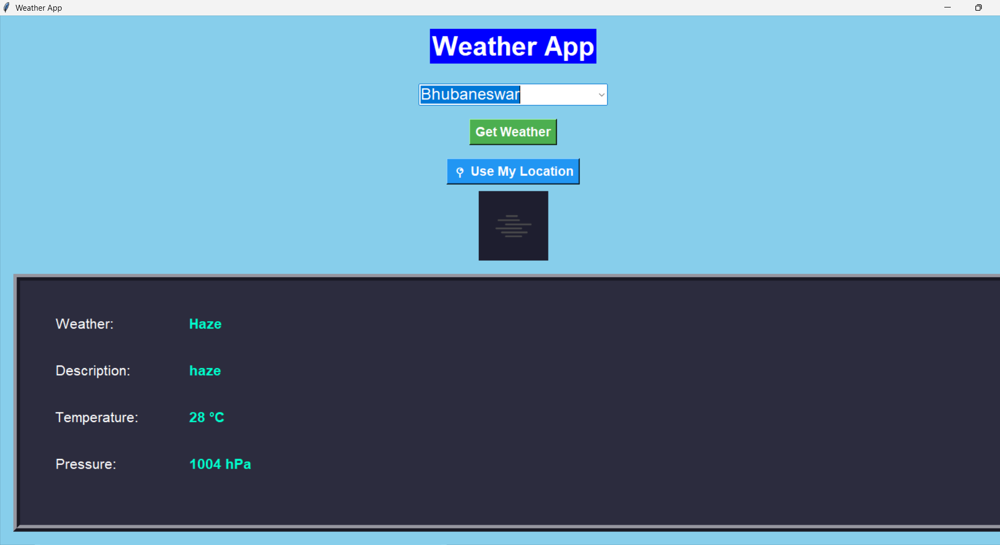

#  Weather App (Python Tkinter)
A modern weather application built using Python and Tkinter with real-time API data.

<h1 align="center">🌦️ Weather App (Python Tkinter)</h1>

  
  
  

  

##  Features
- Auto-location detection
- Live weather updates
- Modern UI design
- Animations
- Weather icons

##  Technologies Used
- Python
- Tkinter
- Requests
- Pillow

##  Installation

pip install requests pillow

##  Run

python weather.py

##  Author
Soumetri Panda
